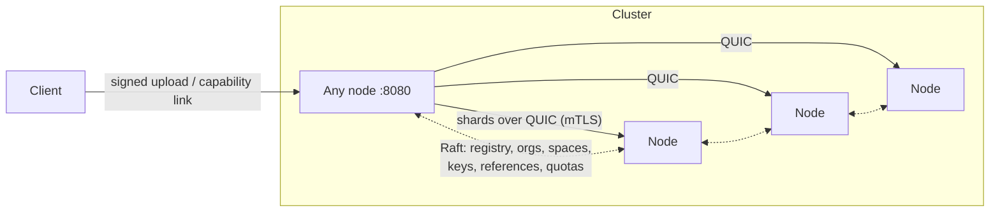

<div align="center">

# Nauka

**A modern file storage engine, safe and complete: Reed-Solomon durability, Ed25519 signed links, quotas. One binary. Rust, AGPL-3.0.**

[](https://github.com/sifrah/nauka/releases/latest)
[](https://github.com/sifrah/nauka/actions/workflows/ci.yml)
[](LICENSE)

[Documentation](https://getnauka.com) · [Quickstart](https://getnauka.com/quickstart/) · [Multi-tenant model](https://getnauka.com/multi-tenant/)

</div>

Nauka is a distributed storage engine for content delivery. It splits every
file into Reed-Solomon shards scattered across the machines of a cluster:
as long as `k` shards per stripe survive somewhere, the file comes back
byte-for-byte identical after a dead node, a rotting disk, or a wiped
region. On top of that storage core sits a complete multi-tenant layer:
organisations, storage spaces, Ed25519 keys, and capability links that are
signed offline and verified locally by any node, with no auth service
anywhere.

What sets it apart:

- **Erasure coding, not replication.** 4+2 by default: any 2 of 6 shards
  can vanish, for a 50% storage overhead where triple replication charges
  200% for the same tolerance.
- **Permissions are cryptography, not infrastructure.** A download link is
  a capability: it carries its expiry, its speed ceiling and its Ed25519
  proof. Your backend mints it offline in microseconds; any node verifies
  it locally against the replicated registry. No token endpoint, no OAuth
  dance, no single point of failure.
- **No shared secrets, ever.** The cluster only holds public keys. A fully
  compromised node can verify signatures; it can never mint one.
- **It proves, it never trusts.** Redundancy is only released against
  `blake3(nonce || bytes)` proofs of possession plus an ownership claim,
  and peers are audited continuously by sampling. BLAKE3 integrity is
  checked at every boundary: a corrupted shard is caught on read and
  treated as lost, never served.
- **One binary, one command per machine.** A cluster is founded by an
  install script and grown with `nauka node add <ip>`. Membership goes
  through Raft consensus: no discovery layer, no split-brain to guard
  against.

| | |
|---|---|
| **Storage** | Reed-Solomon 4+2 stripes, BLAKE3 content addressing, global deduplication, streaming uploads and range reads |
| **Multi-tenancy** | Organisations and spaces replicated to every node; Ed25519 keys with signer/admin roles, rotation and instant revocation |
| **Delivery** | Signed links with expiry and unforgeable per-link speed limits; revocable public direct links; per-space bare-read rate defaults |
| **Quotas** | Logical storage caps per space and per organisation, refused at the door; monthly egress ledger per space, throttled past the cap, never cut |
| **Cluster** | Raft consensus on a dedicated network plane, mTLS QUIC transport, capacity-weighted and topology-aware placement (Vivaldi coordinates, no GeoIP) |
| **Operations** | `nauka top` live TUI with node control, reversible drains, a removal pre-flight that counts shards physically on disks before letting a machine leave, Prometheus metrics |
| **API** | Native HTTP (signed uploads, capability reads); S3-compatible endpoint as an opt-in cargo feature |

## Quick start

First machine, as root on a systemd Linux:

```bash
curl -sSfL https://sh.getnauka.com | sh
```

The installer places the binary and founds a systemd-managed single-node
cluster. Grow it from that machine (provisions the target over SSH):

```bash
nauka node add <new-ip>:7311
```

Create a space and its key (once, thirty seconds):

```bash
nauka org create myapp
nauka space create myapp/files
nauka space key add myapp/files --role admin --name main
# prints the private key ONCE; the cluster only keeps the public half
```

Store a file and hand out a link:

```bash
nauka space sign myapp/files --key nsk_...        # prints curl-ready headers
curl -T report.pdf 'http://<node>:8080/api/upload' -H 'X-Nauka-Space: ...' ...

nauka space link myapp/files <hash> --key nsk_... --ttl 3600 --rate 1000000
# a URL that dies in an hour and cannot be downloaded faster than 1 MB/s,
# both enforced by the signature, valid on any node
```

Packages (`.deb`, `.rpm`, tarballs) are on the
[releases page](https://github.com/sifrah/nauka/releases). From source:
`cargo build --release` (add `--features s3` for the S3 endpoint).

## Tested by breaking it

Every feature lands the same way: full local gate (fmt, clippy, tests),
then validation on a real multi-node WAN cluster before the merge, with
the failure modes exercised on purpose.

- Integration tests kill processes mid-write, cut power to the whole
  cluster, saturate the network, and corrupt shards on disk.
- The bincode append-only discipline of the replicated state is guarded
  by a five-generation snapshot compatibility chain with regression
  tests; seven rolling upgrades shipped on live clusters without an
  incident.
- The garbage collector once lost 4 of a file's 6 shards to a
  mutual-release race between nodes with crossed placement views. The
  forensic is in the commit history, the fix makes mutual deletion
  impossible by construction, and the race is replayed deterministically
  in the test suite.
- Speed limits, quotas and refusal paths in the docs show measured
  numbers, not intentions: a 400 KB/s link measured at 370 KB/s, a
  tampered rate answered by 403, a full space refusing an upload with
  the exact byte counts.

## Architecture

Any node is a complete entry point. A client talks HTTP to whichever node
it likes; that node encodes stripes, pushes shards to their owners over
QUIC, and registers the file in the Raft-replicated registry. Reads
reconstruct from any `k` shards, wherever they live.



The replicated state is deliberately small: manifests, organisations,
spaces, public keys, references, quotas. Everything that scales with an
application's user base lives in that application's own database; the
engine never sees an end user. That boundary is what makes every
permission check local to the node that receives the request.

Placement is rendezvous hashing weighted by declared capacity, stretched
by network distance so the shards of one stripe land far apart: a file
survives the loss of a region, not merely of a machine. Scrubbers rebuild
missing shards continuously; drained or removed nodes hand their data
over with proof-gated transfers.

## Operating a cluster

`nauka top` is a live htop-style view of the cluster (fill rates,
migrations, convergence) and a control panel: select a node, drain it
reversibly, or remove it behind a confirmation. Removal runs a safety
pre-flight that counts shards physically present on the surviving disks
and refuses to leave any file below `k`, naming the files at risk.

Nodes on metered links declare an egress budget
(`NAUKA_EGRESS_QUOTA=20TB`): past it they are deprioritized for reads,
never refused. A per-node stripe cache (`NAUKA_CACHE_SIZE=10GB`) serves
repeat reads from local disk; content addressing means it can never go
stale.

## Documentation

Full documentation at [getnauka.com](https://getnauka.com), sources in
[`site/src/content/docs/`](site/src/content/docs/).

| Document | Contents |
|---|---|
| [Quickstart](https://getnauka.com/quickstart/) | A real cluster in five minutes, spaces included |
| [Organisations & spaces](https://getnauka.com/multi-tenant/) | The multi-tenant model: keys, signed links, direct links, rate limits, quotas |
| [HTTP API](https://getnauka.com/api-http/) | Endpoints, signatures, ranges, TTLs |
| [Deploy a cluster](https://getnauka.com/deploy/) | Keys, ports, systemd, sizing |
| [Growing and shrinking](https://getnauka.com/growing/) | Adding, draining and removing machines safely |
| [Durability & consistency](https://getnauka.com/durability/) | Exactly what survives what |
| [Architecture](https://getnauka.com/architecture/) | Crates, invariants, upload and download flows |
| [Design decisions](https://getnauka.com/decisions/) | Structural choices and stress-test lessons |

## Status

Young, but serious, and honest about it. The multi-tenant layer shipped in
v0.6.0: uploads are signed, owned files are private by default, quotas are
enforced. Still missing before calling it boring: NAT traversal for nodes
behind home routers, multipart and resumable uploads, and the S3 endpoint
predates the tenant model (it remains feature-gated until it is rewired to
spaces). Known limitations are spelled out without hedging in
[Operations](https://getnauka.com/operations/#known-limitations-v1).

## License

[AGPL-3.0](LICENSE).
